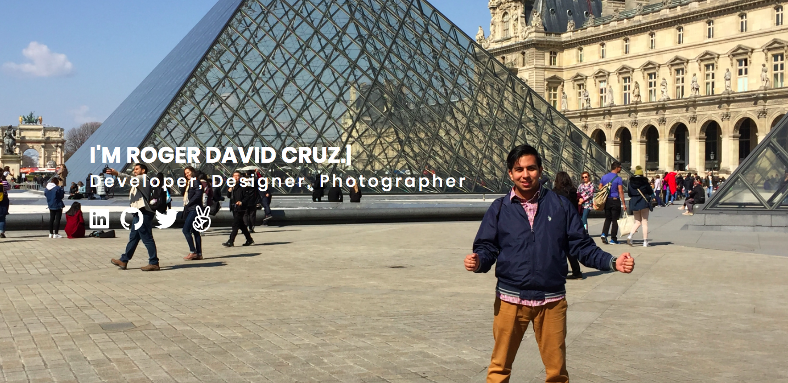

# Personal Portfolio
A personal website built to showcase different projects that I have worked on in the past and currently advancing as well.

**Homepage Cover**

## Usage

1. Navigate to www.rogerdcruz.com

## How It's Made:

**Tech used:** HTML, CSS, JavaScript, Bootstrap, Node.JS, Express, Mongodb

## Optimizations

For future updates I will be adding additional projects I have worked on that are more current and links to my freelance work with non-profit organizations.

## Lessons Learned:

I learned that this project has to be continuously updated as I developed my technical skills further as a software engineer.
